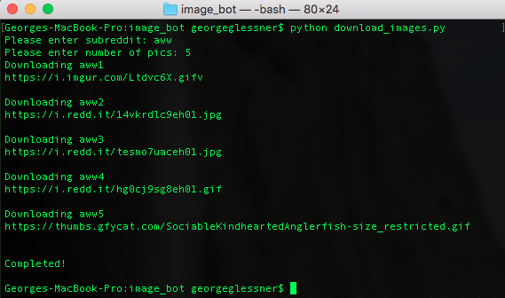
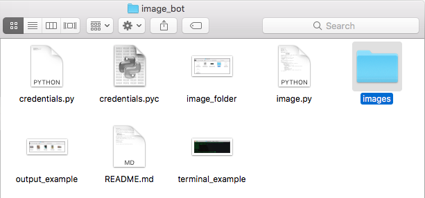
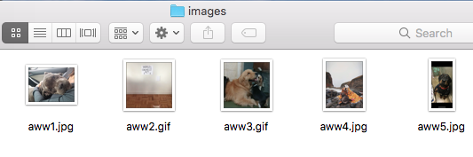

# Reddit Image Downloader

A reddit application that downloads pictures and GIFS from a given subreddit.

## How to use  
First, create a [reddit personal use script application](https://www.reddit.com/prefs/apps/).

Next, add a `credentials.py` file to your working directory and add your applications credentials.

    ID='YOUR_ID'  
    SECRET='YOUR_SECRET'  
    PASSWORD='YOUR_PASSWORD'  
    AGENT='Example Bot by /u/example_bot'  
    USERNAME='YOUR_USERNAME'  

There are two ways to run the application:  

`python download_images.py subreddit number`  

Where __subreddit__ is the subreddit you wish to download images from and __number__ is the number of pictures you want to download.  

Or simply run `python download_images.py` to be prompted to input the subreddit and number of pictures you want to download.

Your images will appear in the "images" folder created by the application.

__Helpful note:__ To view .gif files on a Mac select the image(s) and press "cmd" + "y".

## Example Use

